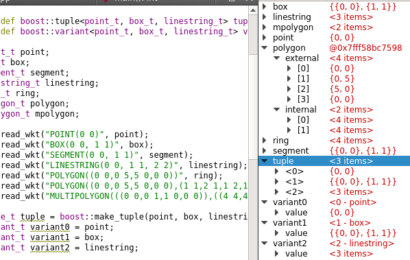

# Debugging Helpers for QtCreator

To use, specify the location of custom helpers in **Tools > Options > Debugger > Locals & Expressions > Extra Debugging Helpers**

Additional information: https://doc.qt.io/qtcreator/creator-debugging-helpers.html

Currently supported:

* Boost.Array
  * boost::array
* Boost.Container
  * boost::container::static_vector
  * boost::container::vector
* Boost.Geometry
  * boost::geometry::index::rtree
  * boost::geometry::model::box
  * boost::geometry::model::d2::point_xy
  * boost::geometry::model::d3::point_xyz
  * boost::geometry::model::geometry_collection
  * boost::geometry::model::linestring
  * boost::geometry::model::multi_point
  * boost::geometry::model::multi_linestring
  * boost::geometry::model::multi_polygon
  * boost::geometry::model::point
  * boost::geometry::model::polygon
  * boost::geometry::model::referring_segment
  * boost::geometry::model::ring
  * boost::geometry::model::segment
  * boost::geometry::segment_identifier
  * boost::geometry::segment_ratio
* Boost.QVM
  * boost::qvm::mat
  * boost::qvm::quat
  * boost::qvm::vec
* Boost.Rational
  * boost::rational
* Boost.Tuple
  * boost::tuple
* Boost.Variant
  * boost::variant
* Boost.Variant2
  * boost::variant2::variant
